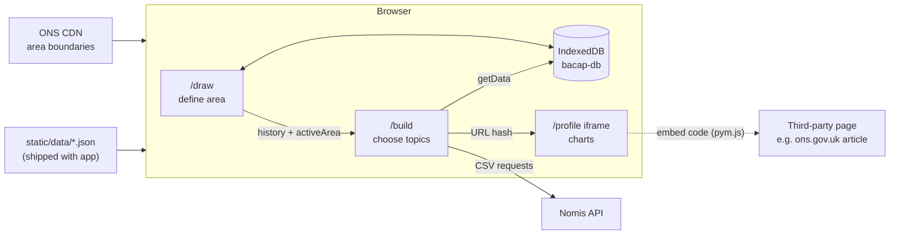

# Architecture

This document gives a high-level overview of how BaCAP ("Build a Custom Area Profile") works. It is
aimed at developers who are new to the codebase. For setup, build and maintenance instructions, see
[README.md](./README.md).

- [Overview](#overview)
- [App structure](#app-structure)
- [Best-fit lookups](#best-fit-lookups)
- [Fetching and transforming data from Nomis](#fetching-and-transforming-data-from-nomis)
- [Inlining data in the profile URL hash](#inlining-data-in-the-profile-url-hash)
- [Synced stores: persisting app state in IndexedDB](#synced-stores-persisting-app-state-in-indexeddb)
- [Caching Nomis API responses in IndexedDB](#caching-nomis-api-responses-in-indexeddb)

## Overview

BaCAP lets a user define an area of England and/or Wales and build a data profile for it. The area
can be drawn on a map, found by searching for a named area, or uploaded as GeoJSON. The profile's
statistics are aggregated from small statistical areas on a best-fit basis, either Output Areas
(OAs) or Lower-layer Super Output Areas (LSOAs).

The app is a SvelteKit (Svelte 5) site built with `@sveltejs/adapter-static`, and is deployed as
plain static files. **There is no backend.** Everything described below happens in the user's
browser:

- **Geography calculations** (which OAs/LSOAs fall inside a shape) run client-side against a
  centroids dataset that ships with the app.
- **Statistics** are requested directly from the [Nomis API](https://www.nomisweb.co.uk/api/v01/help),
  which aggregates the small areas on the fly.
- **Persistence** (app state, reference data, cached API responses) uses the browser's IndexedDB.



## App structure

```
src/
├── lib/
│   ├── config/index.js     # App constants: initialState, appVersion, CDN URLs, geography code types
│   ├── ui/                 # Generic UI components (modals, search, sliders, spinner)
│   ├── viz/                # Chart and map components used in profiles
│   └── util/
│       ├── data/           # Nomis requests (get-data.js), embed hash, data formatting
│       ├── geo/            # Centroids index, polygon editing, GeoJSON parsing/simplification
│       ├── io/             # Reference-data loading, XLSX/CSV export, UTF-8 base64 helpers
│       └── state/          # IndexedDB wrapper and synced stores
└── routes/
    ├── +layout.js          # Prerender config; loads static/data/topics.json for every route
    ├── (app)/              # The interactive tool: /draw, /build, /download
    ├── (embed)/            # Iframe-able pages: /profile, /embed (legacy), /landing
    └── (static)/           # Content pages: home, /glossary
```

### Route groups

- **`(app)`**: the main tool. Its `+layout.svelte` bootstraps the app. On mount it loads
  persisted app state (`getAppState()`) and the reference datasets (areas list, best-fit lookups,
  region/combined authority child lookups, OA data, LSOA centroids). It then builds a `Centroids`
  index from the OA and LSOA data. All of these are exposed to child routes through
  `setContext` as getter functions (`getContext("centroids")()` etc.). Nothing under `(app)`
  renders until they have loaded.
    - `/draw`: draw, buffer or erase shapes on a MapLibre map, or add named areas to a shape.
    - `/build`: choose a primary area and optional comparison area, pick data topics, and view,
      download or embed the resulting profile.
    - `/download`: bulk download a dataset for many areas at once, for example every ward in a
      local authority.
- **`(embed)`**: pages designed to be loaded in an iframe using `pym.js`. They carry no app chrome
  and are marked `noindex`. `/profile` renders a profile entirely from its URL hash (see
  [below](#inlining-data-in-the-profile-url-hash)). `/embed` does the same for legacy embed
  codes created by the previous version of the app, using `static/data/legacy/topics.json`.
- **`(static)`**: plain content pages.

### Reference data

Two kinds of reference data are loaded:

| Data                                   | Source                                     | Loaded by            |
| -------------------------------------- | ------------------------------------------ | -------------------- |
| Topic/dataset definitions              | `static/data/topics.json` (edited by hand) | root `+layout.js`    |
| Areas list for search                  | `static/data/places-list.json`             | `getAreasList()`     |
| OA hierarchy, centroids and population | `static/data/oa21-data.json`               | `getOAdata()`        |
| LSOA centroids                         | `static/data/lsoa21-centroids.json`        | `getLSOAcentroids()` |
| Best-fit lookups for named areas       | `static/data/bestfit-lookup.json`          | `getBestFits()`      |
| Region/combined authority children     | `static/data/rgn-cauth-children.json`      | `getChildLookup()`   |
| Boundary of a named area (GeoJSON)     | ONS CDN (`geoUrl`)                         | fetched on demand    |

The `static/data/` files are generated from `raw_data/` or from
[ONSdigital/geo-scripts](https://github.com/ONSdigital/geo-scripts) by the `data:*` npm scripts.
The larger files are stored in a column-compressed format (`compress-csv-to-json`) and are
decompressed in the browser.

`loadData()` in `src/lib/util/io/index.js` caches each dataset in IndexedDB after its first
download. When `appVersion` in `src/lib/config/index.js` differs from the version stored in
IndexedDB, the cached datasets are ignored and downloaded again. This means bumping `appVersion`
is how a change to the reference data reaches returning users. The new version is saved only after
every dataset has reloaded, so a failed refresh is tried again on the next visit. Bumping
`appVersion` does **not** clear the user's saved app state
([see below](#versioning-and-migrations)).

## Best-fit lookups

Nomis publishes statistics for OAs and LSOAs and for the standard geographies they build up to.
BaCAP describes any area as a **set of OA codes and a set of LSOA codes**, stored as
`properties.oa21cds` and `properties.lsoa21cds` on the area's GeoJSON feature. Each topic in
`topics.json` has a `geography` of either `oa21` or `lsoa21`, which determines which set is sent to
Nomis for that topic.

### Calculating best-fits for a drawn shape

Best-fit uses a **centroid-in-polygon** rule: a small area is included if its centroid falls inside
the shape. The rule is implemented by the `Centroids` class
(`src/lib/util/geo/centroids.js`):

1. On startup, `Centroids` converts the OA and LSOA centroids into GeoJSON point collections. From
   the columns of `oa21-data.json` (`oa21cd → lsoa21cd → msoa21cd → ltla21cd → rgn21cd`) it also
   builds a `parents` map and a `children` map covering the full hierarchy.
2. When the user finishes drawing a polygon or clicks with the radius tool,
   `DrawMap.applyShape()` calls `centroids.inPolygon(shape, "oa")` and
   `centroids.inPolygon(shape, "lsoa")`. Each returns the `Set` of codes whose centroids fall inside
   the shape, found with `@turf/boolean-point-in-polygon`.
3. The resulting sets are combined with the current selection according to the draw mode:
    - **add**: set union, with the drawn geometry merged using `@turf/union`
    - **subtract** (erase mode): set difference, with the geometry cut using `@turf/difference`
    - **replace**: the new sets and geometry replace the current ones

    The `Polygon` class (`polygon.svelte.js`) keeps the geometry that is displayed.

4. The new `{ geometry, oa, lsoa }` state is added to the front of `history` (up to 10 entries,
   which powers undo/redo). Editing a shape also clears the area's GSS code, because it no longer
   matches an official area.

The population counter on the map sums the `population` of the selected OAs
(`centroids.population()`), so the user gets immediate feedback without calling any API.

### Named areas and uploaded GeoJSON

Selecting a named area such as a ward or local authority fetches its boundary from the ONS CDN.
Those files already contain precomputed `oa21cds`/`lsoa21cds` lists, and `parseGeoJSON()`
uses these when they are present. For an uploaded file without them, `parseGeoJSON()` falls back
to the same `centroids.inPolygon()` calculation, first converting British National Grid
coordinates to WGS84 if the file uses them. If the code is itself an OA or LSOA code, the area is
simply its own best-fit.

`/download` works with lists of child areas rather than drawn shapes. It uses the prebuilt
`bestfit-lookup.json`, generated by `npm run data:lookups` from geo-scripts. This maps a higher
geography code to the lower-level codes that best fit it, for example a combined authority to its
constituent local authorities. Areas that are not in the lookup are treated as their own best-fit.

### Compressing and expanding code sets

A large area can contain tens of thousands of OAs, which is too many to store in a URL or send to
Nomis. `centroids.compress(codes)` walks up the hierarchy. Wherever **every** child of a parent is
present, it replaces the children with the parent's code, repeating level by level. The result is
the smallest mixed list of OA, LSOA, MSOA, LTLA and region codes that covers exactly the same OAs.
`centroids.expand(codes, level)` reverses this.

Areas are persisted and sent to Nomis in compressed form, and expanded again only when a full list
is needed, for example to redraw a shape on `/draw` or to copy the OA/LSOA code lists.

### Choosing a comparison area

When `/build` receives a new primary area, it calls `centroids.commonParent()` to find the smallest
parent area (LTLA, region, country, etc.) that fully contains the selection. It then loads that
area's boundary as the default comparison area.

## Fetching and transforming data from Nomis

All live statistics come from the Nomis API through `getData(table, areas)` in
`src/lib/util/data/get-data.js`. Here `table` is a topic definition from `topics.json`, and
`areas` is the primary area plus the optional comparison area.

### Building the request

Each request is a Nomis `…/dataset/{tableCode}.data.csv` URL (`makeUrlFn()`). It uses Nomis's
`MAKE` syntax to aggregate on the server, so the browser never downloads data for individual OAs:

- **Geography**: each area becomes `MAKE|<areacd>|<code1>;<code2>;…`, built from its compressed
  OA or LSOA codes (`makeGeo()`). If the area is a single official area whose only code is its own
  GSS code, that code is sent directly. Areas without a GSS code, such as drawn shapes, are given
  placeholder codes like `X00000001` (`fillAreaCodes()`) so that rows in the response can be
  matched back to them.
- **Categories**: a category built from several Nomis cells becomes
  `MAKE|<label>|<cell1>;<cell2>`. Single-cell categories are sent as the cell code (`makeCells()`).
- **Other parameters**: `date`, `measures` (only measures that have a Nomis `cell`), a fixed
  `select` column list, and any topic-specific `miscParams` such as `gender=0`.

### Chunking

Nomis limits both URL length and response size, so `makeUrls()` splits the areas across several
requests. A new URL is started when either:

- the URL would reach `maxRequestLength` (15,700 characters), or
- the number of codes in the request would exceed
  `maxResponseCells / (categories × dates × measures)`, where `maxResponseCells` is 25,000.

Areas with no codes for the topic's geography are skipped, because the area is too small for a
best-fit.

### Parsing and transforming the response

For each URL, the CSV response is processed by `parseData()`:

1. **Parse** with `d3-dsv`. Each row is mapped into the app's tidy format:
   `{ areacd, areanm, date, category, measure, value }`. Nomis codes are translated back to the
   labels in `topics.json`. Nomis strips colons from `MAKE` labels, so the lookup removes them
   too.
2. **Sort** into a fixed order: area, then date, then category, then measure, following the order
   in the request and in `topics.json` rather than the order Nomis returns. This order matters,
   because the embed hash stores values by position
   ([see below](#inlining-data-in-the-profile-url-hash)).
3. **Derive percentages** when necessary. Some Nomis tables can't return a percentage, and in
   `topics.json` their topics define a `Percent` measure with `cell: null`. For these,
   `calcPercentages()` sums values across categories for each area and date, and adds a `Percent`
   row (rounded to 1 decimal place) after each value row.

`getData()` returns `{ meta: table, data }`. If a request fails, for example because Nomis is
down, it returns `{ message: "Could not load data" }`.

### How `/build` calls it

In `BuildProfile.svelte`, `tables` is a single `$derived` value built with `await Promise.all(...)`.
It calls `getData()` for **every** selected topic, filtered to those whose coverage and geography
suit the current area. Svelte re-runs the whole derivation whenever any input changes, such as
adding a topic, changing the comparison area or editing the shape. Every topic is then requested
again, not just the one that changed. This is why the response cache described
[below](#caching-nomis-api-responses-in-indexeddb) is important.

The same `tables` feed the XLSX/CSV downloads (`downloadProfileXLSX()` and
`downloadProfileCSV()` in `io/index.js`) and the embed hash.

## Inlining data in the profile URL hash

The profile preview on `/build` and every embedded profile are rendered by the same page,
`/profile`, loaded in an iframe using `pym.js`. That page **never contacts Nomis**. It renders only
from data encoded in its URL hash (`#…`). As a result:

- a profile embedded in an ONS article or third-party page makes no API requests, so a busy page
  doesn't send traffic to Nomis for every visitor;
- an embedded profile is a fixed snapshot of the data when it was created, and doesn't change
  as Nomis data is revised;
- the preview on `/build` is exactly what will be embedded.

### Encoding (`makeEmbedHash()` in `src/lib/util/data/index.js`)

The hash is `btoaUtf8(JSON.stringify(payload))`, a UTF-8-safe base64 encoding, where `payload`
contains:

```js
{
  areas: ["My area", "Comparison area"],     // area names only
  tables: [
    { key: "resident_age", data: [4.9, 5.6, …], range: [2014, 2024] },
    …
  ],
  polygons: [ /* simplified GeoJSON geometries, if maps are included */ ]
}
```

To keep the hash small:

- **Metadata is left out.** Each table stores only its topic `key`. Labels, categories, units,
  sources and chart types are taken from `topics.json` when the hash is rendered.
- **Only values are stored**, as a flat array in the fixed area → date → category order produced by
  `getData()`. When a topic has more than one measure, only the `Percent` values are kept.
- **Dates are stored as a range**: the first and last dates, not every date.
- **Polygons are simplified** with `simplifyGeo()`, which repairs the geometry, drops very small
  parts of multipolygons, simplifies and rounds coordinates, and repeats until the GeoJSON is under
  5,000 characters.

### Decoding (`src/routes/(embed)/profile/+page.svelte`)

The page decodes the hash with `atobUtf8()` and `expandTables()` rebuilds the tidy rows. It loops
over areas × dates (sliced from the topic's `dates` using the stored `range`) × the topic's
`categories`, taking the next value from the array each time. The page listens for `hashchange`,
so `/build` updates the preview by setting the iframe's `location.hash`, without reloading it.

The parent page sends pym messages (`png`, `print`) to the iframe to save a PNG with `snapdom` or
to print. The embed code from `makeEmbedCode()` loads the same `/profile` page on the live ONS site
with the hash attached.

> **Compatibility note:** because the hash relies on `topics.json` for everything except values,
> existing embeds depend on each topic's `key`, the order of its `categories`, and its `dates`.
> Renaming a key, reordering or removing categories, or removing dates will corrupt existing
> embeds. Adding new dates to the end of a topic is safe, because embeds store the date range they
> used. The previous version of the app used a different format, which is why `/embed` and
> `static/data/legacy/topics.json` are kept.

## Synced stores: persisting app state in IndexedDB

The user's work (their current area, comparison area, saved areas, draw history and selected topics)
is kept across page navigations **and** across browser sessions. It is stored in IndexedDB through
"synced" Svelte stores (`src/lib/util/state/`).

### The IndexedDB wrapper (`db.js`)

`db.js` wraps [`idb-keyval`](https://github.com/jakearchibald/idb-keyval) around a single
object store, `bacap-db` / `store`, with `get`, `set`, `update` and `del` functions. This one store
holds app state, cached reference datasets and cached Nomis responses, each under its own key.
Because IndexedDB uses the structured clone algorithm, values such as `Set` and `Map`, which JSON
can't represent, can be stored directly. The OA/LSOA code sets are stored this way.

### Synced stores (`get-app-state.js`)

`syncedStore(key, initialValue)` is a standard Svelte `writable` with a modified `set()`:

```js
set: (val) => {
	set(val); // update subscribers as normal
	syncState(key, snapshot(val)); // write a plain copy to IndexedDB
};
```

`snapshot()` (`snapshot.svelte.js`) wraps `$state.snapshot()`, which turns Svelte 5 `$state`
proxies into plain objects. Without this, a proxy that reaches the store couldn't be
structured-cloned into IndexedDB.

The write is **fire-and-forget**: it isn't awaited, so the UI never waits for IndexedDB. Only
`set()` persists the value. Store `update()` is passed through unchanged and does not persist, so
the codebase changes stores by assignment: `$activeArea = …`, or a nested mutation such as
`$activeArea.properties.areacd = null`. Svelte compiles both of these to `store.set()`.

### Startup (`getAppState()`)

`getAppState()` runs in the `(app)` layout. For each key in `initialState` (in
`src/lib/config/index.js`) it:

1. reads the stored value from IndexedDB;
2. if nothing is stored, writes the default from `initialState` and uses that;
3. creates a synced store holding the value.

It returns an object of stores (`{ activeArea, comparisonArea, savedAreas, history, … }`), which
the layout shares through `setContext("appState", …)`. Pages destructure the stores they need and
use them with the `$store` syntax.

### Versioning and migrations

The user's saved state (`savedAreas` in particular) is meant to last across releases, so it is
**not** cleared when `appVersion` changes. `getAppState()` is given the version previously stored
in IndexedDB (`null` for a new user). If a future release changes the structure of stored state in
a way that would break or corrupt existing data, add a migration for that specific version at the
start of `getAppState()`, for example `if (storedAppVersion && storedAppVersion < 2) { … }`, which
can amend, restructure or clear only the affected keys.

### Coordinating pages through shared state

Because `/draw` and `/build` read and write the same stores, they pass the user's selection back
and forth without URL parameters:

- Every change on `/draw` pushes a new entry onto `history` and sets
  `lastActivePage = "draw"`. When `/build` mounts after that, it copies `history[0]` into
  `activeArea` (compressing the code sets) and picks a new default comparison area.
- Changing the area on `/build` sets `lastActivePage = "build"`. When the user goes back to
  `/draw`, it replaces the drawn shape with the new `activeArea`.
- Either page also accepts a GSS code in the URL hash, such as `/build/#E06000001`, to load a
  named area directly. The `/landing` embed uses this to send users into the tool.

State is stored per browser and per origin. There is no sync across devices, and nothing is shared
between users.

## Caching Nomis API responses in IndexedDB

Because `/build` requests every selected topic again whenever anything changes
([see above](#how-build-calls-it)), one user editing a profile will often repeat the same Nomis
request many times. For example, adding a fourth topic re-runs the requests for the first three,
and switching the comparison area back and forth repeats earlier requests. With no server-side
layer to cache responses, `get-data.js` caches them in the browser.

### How it works

- **Key**: the full Nomis request URL. The URL encodes the table, dates, categories, measures and
  the exact compressed geography codes, so two requests that would return the same data produce
  the same key.
- **Value**: the raw CSV text of the response. The response is cached before parsing, so parsing
  and percentage calculations always run on the current code, and a parsing change never leaves
  stale results in the cache.
- **Storage**: a single `Map` stored under the `cachedData` key in the same IndexedDB store as the
  app state. It persists across sessions, so returning to the same area on a later day is also
  served from the cache.
- **Lookup**: `getData()` calls `getCache(url)` for each chunked URL before fetching. On a hit,
  the cached CSV is parsed and no request is made. On a miss, the response is fetched, parsed and
  written with `setCache(url, csv)`, which is not awaited.
- **Size limit**: the map holds at most **1,000 URLs** (`maxCacheSize`). When it's full, the oldest
  entry is removed. `Map` keeps insertion order, so this is first-in, first-out; reading an entry
  does not move it to the back.
- **Failures**: failed requests are not cached, so the next attempt tries Nomis again.

### Trade-offs

- The cache **never expires by age**. Cached responses stay until they're pushed out by newer
  entries. Nomis rarely revises historical figures, and new data periods mean new `date` values and
  therefore new URLs, so stale results are rare in practice. Clearing the site data in the browser
  resets the cache.
- The whole `Map` is read from IndexedDB on every lookup and rewritten on every insert. This is
  fast enough at the current limit, but raising `maxCacheSize` a lot would make each lookup slower.
- The cache belongs to one browser, so it only avoids repeated requests from the same user. Sharing
  cached responses between users would need a server-side cache or proxy, and the static
  deployment model doesn't provide one.
